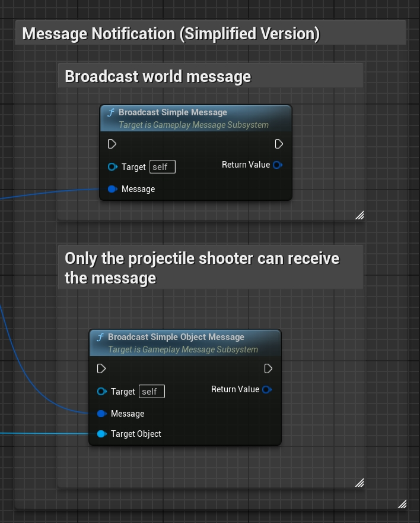
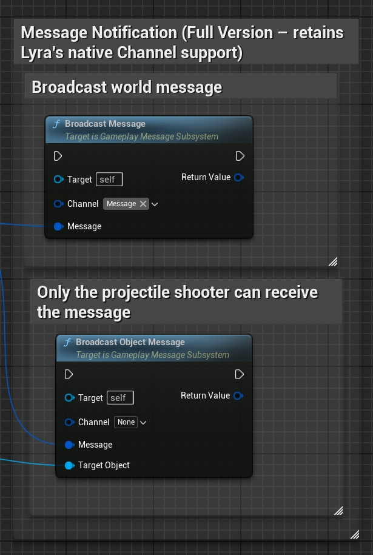
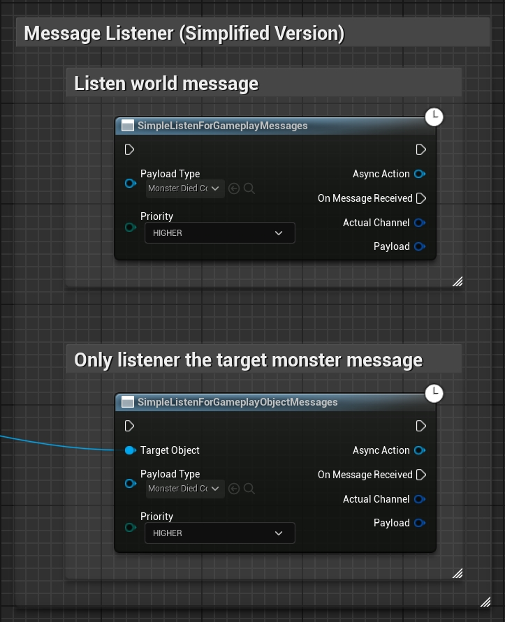
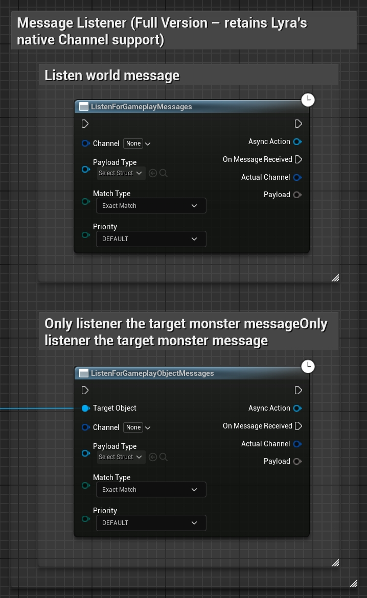
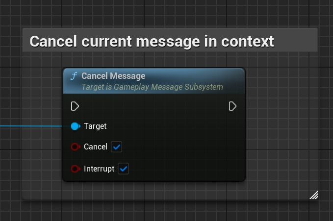

# Gameplay Message Router (UGC Enhanced Version)

This project is based on Unreal Engine's Lyra project ([GameplayMessageRouter](https://github.com/EpicGames/UnrealEngine/tree/ue5-main/Samples/Games/Lyra/Plugins/GameplayMessageRouter)) and has been enhanced with design concepts inspired by Minecraft's messaging system. The system is optimized for User Generated Content (UGC) workflows, aiming to achieve intuitive and flexible communication between independent game objects while using unified message structs as keys for both sending and listening. This approach significantly simplifies the development process (as sending and receiving use the same data structure) while retaining GameplayTag-based channel filtering for better compatibility and fine-grained control. Key features include:
- **Message Struct as Key:** Uses message struct types as keys, eliminating tedious tag management;
- **Object-Specific Messages:** Supports message delivery to specific target objects, ensuring only listeners registered to that object receive messages;
- **Priority Handling:** Allows specifying priority when registering listeners, ensuring critical business logic executes before lower priority handlers;
- **Cancellation Mechanism:** Listeners can cancel message execution in callbacks and optionally block subsequent listener processing, with cancellation status feedback to the sender.

中文版本：[README_CN.MD](README_CN.MD)

## Examples and Features

- **Structured Message System:**  
  Uses message struct types as unique keys for sending and receiving messages, allowing both sender and receiver to work with the same data structure while maintaining support for GameplayTag-based channel filtering.

- **Object-Specific Messages:**  
  Enables sending messages to specific objects, ensuring only listeners related to that object receive the data, perfect for local or specific scenario event handling.

- **Priority Handling:**  
  Allows specifying priority when registering listeners, ensuring high-priority listeners process messages before others, preventing unexpected behaviors due to execution order.

- **Cancellation Mechanism:**  
  Listeners can cancel current message execution in callbacks and optionally block subsequent listener calls, with message senders able to detect if their message was cancelled.

## Examples

Simply copy this plugin to your project's `Plugins` folder (e.g., `YourProject/Plugins/GameplayMessageRouter`) and regenerate project files to start using the enhanced Gameplay Message Router. Supports both Blueprint and C++ projects.

1. **Message Sending**

  - Message Notification (Simplified Version)
    - C++ Implementation
    ```cpp
        // Template parameter <FFireModeStandardMessage_AfterDamage> struct type serves as the message key.
        // First parameter is the message body (carrying specific data).
        // Second parameter is the target object (optional), when not passed, the message is global (all Listeners can receive).
        // Broadcast world message
        MessageSubsystem.BroadcastSimpleMessage<FFireModeStandardMessage_AfterDamage>(FireModeStandardMessage_AfterDamage);
        // Only the projectile shooter can receive the message
        MessageSubsystem.BroadcastSimpleMessage<FFireModeStandardMessage_AfterDamage>(FireModeStandardMessage_AfterDamage, BasicProjectile->ProjectileInstigator);
    ```
    - Blueprint Implementation
    {: height="640"}

  - Message Notification (Full Version – retains Lyra's native Channel support)
    - C++ Implementation
    ```cpp
        // Broadcast world message
        MessageSubsystem.BroadcastMessage<FFireModeStandardMessage_AfterDamage>(FireModeStandardMessage_AfterDamage, FGameplayTag::EmptyTag);
        // Only the projectile shooter can receive the message
        MessageSubsystem.BroadcastMessage<FFireModeStandardMessage_AfterDamage>(FireModeStandardMessage_AfterDamage, FGameplayTag::EmptyTag, BasicProjectile->ProjectileInstigator);
    ```
    - Blueprint Implementation
    {: height="640"}

2. **Message Listening**

  - Message Listener (Simplified Version)
    - C++ Implementation
    ```cpp
        // Template parameter <FGameplayShipEnterEventData> struct type serves as the message key.
        // First parameter is the callback function, called when message triggers.
        // Second parameter specifies listener priority, in this case EGameplayMessagePriority::HIGHER, ensuring this callback executes first.
        // Third parameter is target object (optional), when not passed, listens to global messages.
        // Listen world message
        MessageSubsystem.RegisterListener<FGameplayShipEnterEventData>([WeakThis](FGameplayTag Channel, const FGameplayShipEnterEventData& Event)
            {
                // gameplay logic ...
            },
            EGameplayMessagePriority::HIGHER);
        // Only listener the target ship message
        MessageSubsystem.RegisterListener<FGameplayShipEnterEventData>([WeakThis](FGameplayTag Channel, const FGameplayShipEnterEventData& Event)
                {
                    // gameplay logic ...
                },
                EGameplayMessagePriority::HIGHER,
                GetOwner());
    ```
    - Blueprint Implementation
    {: height="640"}

  - Message Listener (Full Version – retains Lyra's native Channel support)
    - C++ Implementation
    ```cpp
        // Listen world message
        MessageSubsystem.RegisterListener<FGameplayShipEnterEventData>(FGameplayTag::RequestGameplayTag("Message"), [WeakThis](FGameplayTag Channel, const FGameplayShipEnterEventData& Event)
            {
                // gameplay logic ...
            },
            EGameplayMessageMatch::ExactMatch,
            EGameplayMessagePriority::HIGHER);
        // Only listener the target ship message
        MessageSubsystem.RegisterListener<FGameplayShipEnterEventData>(FGameplayTag::RequestGameplayTag("Message"), [WeakThis](FGameplayTag Channel, const FGameplayShipEnterEventData& Event)
                {
                    // gameplay logic ...
                },
                EGameplayMessageMatch::ExactMatch,
                EGameplayMessagePriority::HIGHER,
                GetOwner());
    ```
    - Blueprint Implementation
    {: height="640"}

3. **Message Cancellation**
    - C++ Implementation
    ```cpp
        // Cancel current message in context
        // First parameter true indicates cancelling the message, sender can detect this cancellation flag.
        // Second parameter true indicates blocking all subsequent Listener execution after cancellation.
        MessageSubsystem.CancelMessage(true, true);
    ```
    - Blueprint Implementation
    {: height="640"}

## Best Practices Guide

1. Message Structure Design
- Recommend using a reasonable object inheritance system to organize message structures
- Define common properties through base classes to avoid duplicate field definitions in child message classes
- Maintain clarity and maintainability of message structures

2. Message Object Granularity Selection
- Recommend using Character or Monster (Pawn) level as message object granularity
- Avoid overly broad global messages:
  * May lead to message handling logic being interfered with by unexpected objects
  * Increases system complexity and debugging difficulty
- Avoid too fine granularity (like individual bullets) as message objects:
  * Reduces reusability of message handling logic
  * May lead to duplicate implementation of similar functionality

3. Priority Standards
Recommend using unified standards to define priorities to avoid random insertion of high-priority logic making business order difficult to maintain.

| Priority | Usage Scenario | Example |
|----------|---------------|---------|
| HIGHEST | Critical Process Control | Behavior Restrictions, State Locking |
| HIGHER | Core Business Logic | Attribute Buffs, Passive Skills |
| DEFAULT | Regular Business Logic | Standard Feature Implementation |
| LOWER | Secondary Business Processing | Post-value Calculations |
| LOWEST | Cleanup Logic | State Cleanup, Resource Recovery |
| MONITOR | System Monitoring | Anti-cheat Detection, Logging |

4. Message Cancellation
  - The cancellation logic in the message system only serves as a marker; message senders need to implement specific cancellation handling logic. Processing logic includes:
    * Terminating skill casting process when skill release is cancelled
    * Correctly handling related resource (like skill CD, consumables) rollback operations
    * Ensuring system state consistency
  - For example: When fire logic detects fire cancellation, it needs to cancel the current fire operation and correctly handle CD and other value processes.

## License

This project is developed based on Epic Games' Lyra sample project. According to the [Unreal Engine EULA](https://www.unrealengine.com/eula), you can freely use and modify this project to develop your games.

If you plan to use or modify this project, please ensure compliance with:
1. Unreal Engine End User License Agreement (EULA)
2. Epic Games' Intellectual Property Policy