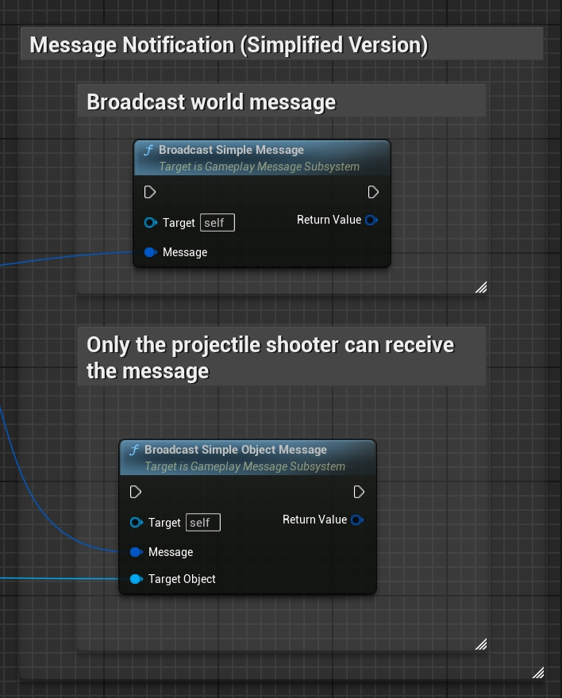
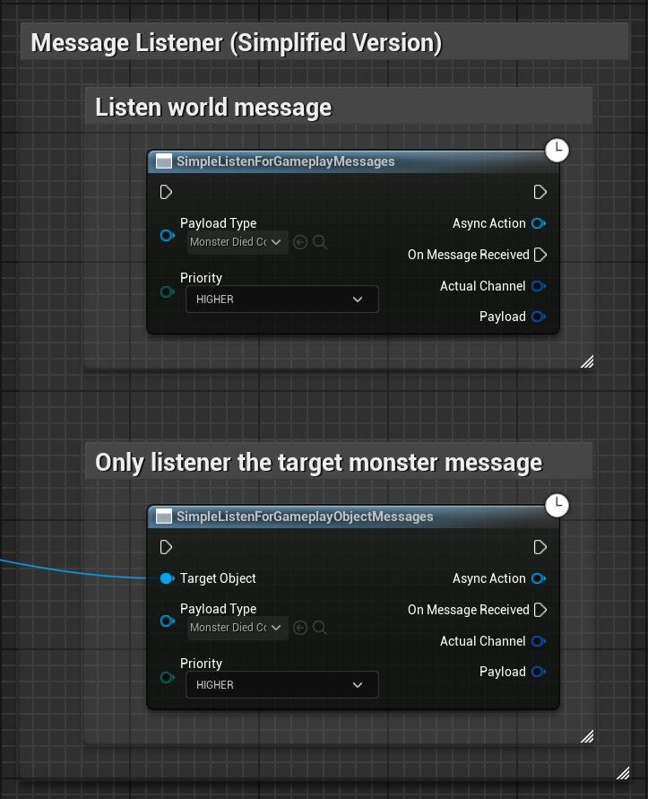
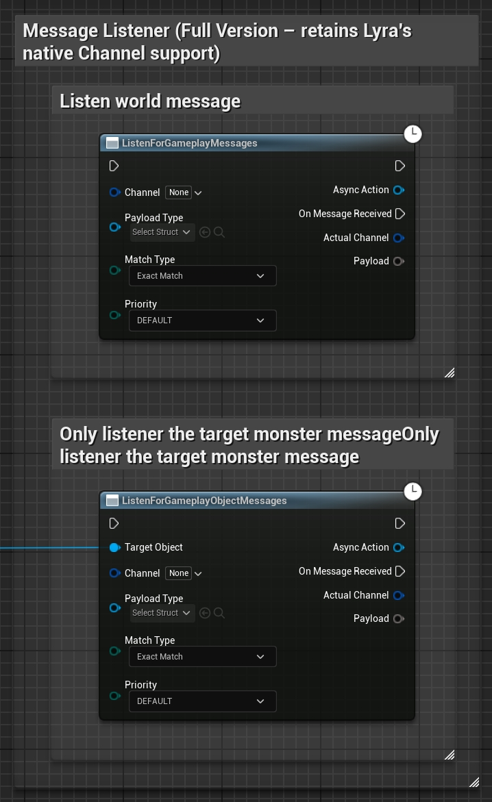

# Gameplay Message Router (UGC 增强版)

该项目基于 Unreal Engine 的 Lyra 项目([GameplayMessageRouter](https://github.com/EpicGames/UnrealEngine/tree/ue5-main/Samples/Games/Lyra/Plugins/GameplayMessageRouter))进行二次开发，并参考了 Minecraft 消息系统的设计理念进行改进。系统针对用户生成内容（UGC）的工作流程进行了优化，旨在实现独立游戏对象之间直观且灵活的信息传递，同时采用统一的消息结构体作为键值用于发送与监听。这样不仅大幅简化了开发流程（因为发送和接收均使用相同的数据结构），还保留了基于 GameplayTag 的频道过滤功能，实现了更好的兼容性与细致控制。其主要特点包括：
- **消息结构体键值：** 使用消息结构体类型作为键，避免繁琐的标签管理；
- **对象专属消息：** 支持面向特定目标对象的消息传递，确保只有注册了该对象的监听器能接收消息；
- **优先级处理：** 允许注册监听器时指定优先级，保证关键业务逻辑先于低优先级处理；
- **取消机制：** 监听器回调中可取消消息执行，并选择阻断后续监听器的处理，同时将消息取消状态反馈给发送者。

English version: [README.MD](README.MD)

## 示例与功能说明

- **结构化消息系统：**  
  通过使用消息结构体类型作为唯一键来发送和接收消息，使得发送方与接收方基于同一数据结构工作，同时依然支持基于 GameplayTag 的频道过滤功能。

- **对象专属消息：**  
  可以针对特定对象发送消息，从而确保只有与该对象相关的监听器接收到数据，非常适用于局部或特定场景的事件处理。

- **优先级处理：**  
  在注册监听器时可以指定优先级，确保高优先级的监听器能够先于其他监听器处理消息，避免因执行顺序不当而引发意外行为。

- **取消机制：**  
  监听器在回调中可以取消当前消息的执行，并可选择阻断后续监听器的调用，消息发送方也能获知该消息是否被取消。

## 示例

只需将本插件复制到您项目的 `Plugins` 文件夹中（例如：`YourProject/Plugins/GameplayMessageRouter`），然后重新生成项目文件，即可开始使用增强版 Gameplay Message Router。支持蓝图与C++项目。

1. **消息发送**

  - Message Notification (Simplified Version)
    - C++实现
    ```cpp
    // 模板参数 <FFireModeStandardMessage_AfterDamage> 的结构提类型用作消息的 Key。
    // 第一个参数为消息体（携带具体数据）。
    // 第二个参数为目标对象（可选），未传时该消息为全局消息（所有 Listener 均可收到）。
    
    // Broadcast world message
    MessageSubsystem.BroadcastSimpleMessage<FFireModeStandardMessage_AfterDamage>(
        FireModeStandardMessage_AfterDamage
    );
    
    // Only the projectile shooter can receive the message
    MessageSubsystem.BroadcastSimpleMessage<FFireModeStandardMessage_AfterDamage>(
        FireModeStandardMessage_AfterDamage,
        BasicProjectile->ProjectileInstigator
    );
    ```
    - Blueprint实现
    {: height="640"}

  - Message Notification (Full Version – retains Lyra's native Channel support)
    - C++实现
    ```cpp
    // Broadcast world message
    MessageSubsystem.BroadcastMessage<FFireModeStandardMessage_AfterDamage>(
        FireModeStandardMessage_AfterDamage,
        FGameplayTag::EmptyTag
    );
    
    // Only the projectile shooter can receive the message
    MessageSubsystem.BroadcastMessage<FFireModeStandardMessage_AfterDamage>(
        FireModeStandardMessage_AfterDamage,
        FGameplayTag::EmptyTag,
        BasicProjectile->ProjectileInstigator
    );
    ```
    - Blueprint实现
    {: height="640"}

2. **消息监听**

  - Message Listener (Simplified Version)
    - C++实现
    ```cpp
    // 模板参数 <FGameplayShipEnterEventData> 的结构提类型用作消息的 Key。
    // 第一个参数为回调函数，当消息触发时调用。
    // 第二个参数指定了监听器的优先级，本例中为 EGameplayMessagePriority::HIGHER，确保该回调优先执行。
    // 第三个参数为目标对象（可选），未传时该消息为全局消息（所有 Listener 均可收到）。
    
    // Listen world message
    MessageSubsystem.RegisterListener<FGameplayShipEnterEventData>(
        [WeakThis](FGameplayTag Channel, const FGameplayShipEnterEventData& Event) {
            // gameplay logic ...
        },
        EGameplayMessagePriority::HIGHER
    );
    
    // Only listener the target ship message
    MessageSubsystem.RegisterListener<FGameplayShipEnterEventData>(
        [WeakThis](FGameplayTag Channel, const FGameplayShipEnterEventData& Event) {
            // gameplay logic ...
        },
        EGameplayMessagePriority::HIGHER,
        GetOwner()
    );
    ```
    - Blueprint实现
    {: height="640"}

  - Message Listener (Full Version – retains Lyra's native Channel support)
    - C++实现
    ```cpp
    // Listen world message
    MessageSubsystem.RegisterListener<FGameplayShipEnterEventData>(
        FGameplayTag::RequestGameplayTag("Message"),
        [WeakThis](FGameplayTag Channel, const FGameplayShipEnterEventData& Event) {
            // gameplay logic ...
        },
        EGameplayMessageMatch::ExactMatch,
        EGameplayMessagePriority::HIGHER
    );
    
    // Only listener the target ship message
    MessageSubsystem.RegisterListener<FGameplayShipEnterEventData>(
        FGameplayTag::RequestGameplayTag("Message"),
        [WeakThis](FGameplayTag Channel, const FGameplayShipEnterEventData& Event) {
            // gameplay logic ...
        },
        EGameplayMessageMatch::ExactMatch,
        EGameplayMessagePriority::HIGHER,
        GetOwner()
    );
    ```

    - Blueprint实现
    {: height="640"}

3. **消息取消**
    - C++实现
    ```cpp
    // Cancel current message in context
    // 取消当前消息上下文的处理：
    // 第一个参数 true 表示取消消息，发送方可以通过该标记检测到消息已被取消。
    // 第二个参数 true 表示在取消消息后阻断所有后续 Listener 的执行，后续监听器将不会再收到该消息。
    MessageSubsystem.CancelMessage(true, true);
    ```
    - Blueprint实现
    {: height="640"}

## 最佳实践指南

1. 消息结构设计
- 建议采用合理的对象继承体系来组织消息结构
- 通过基类定义共用属性，避免子类消息中的重复字段定义
- 保持消息结构的清晰性和可维护性

2. 消息对象粒度选择
- 建议以角色(Character)或Monster(Pawn)级别作为消息对象粒度
- 避免使用过于宽泛的全局消息：
  * 可能导致消息处理逻辑被非预期对象干扰
  * 增加系统复杂度和调试难度
- 避免过细粒度(如单个子弹)作为消息对象：
  * 会降低消息处理逻辑的复用性
  * 可能导致相似功能代码的重复实现

3. 优先级规范
推荐使用统一规范来定义优先级，避免随意插入高优先逻辑导致业务顺序难以维护。

| 优先级 | 使用场景 | 示例 |
|--------|----------|------|
| HIGHEST | 关键流程控制 | 行为限制、状态锁定 |
| HIGHER | 核心业务逻辑 | 属性增益、被动技能 |
| DEFAULT | 常规业务逻辑 | 标准功能实现 |
| LOWER | 次要业务处理 | 后置数值计算 |
| LOWEST | 收尾处理逻辑 | 状态清理、资源回收 |
| MONITOR | 系统监控功能 | 反作弊检测、日志记录 |

4. 消息取消
  - 消息系统中的取消逻辑只起到标记作用，消息发送方需要自行实现具体的取消处理逻辑。处理逻辑包括：
    * 检测到技能释放被取消时，终止技能施放流程
    * 正确处理相关资源（如技能CD、消耗品等）的回退操作
    * 确保系统状态的一致性
  - 例如：开火逻辑检测到开火小区被取消后，需要取消本次开火操作，并正确处理CD等数值流程。

## License

本项目基于 Epic Games 的 Lyra 示例项目进行开发。根据 [Unreal Engine EULA](https://www.unrealengine.com/eula)，您可以自由使用和修改本项目用于开发您的游戏。

如果您计划使用或修改本项目，请确保遵守:
1. Unreal Engine 最终用户许可协议 (EULA)
2. Epic Games 的知识产权政策